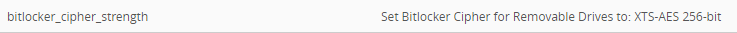

# bitlocker-sensors
Sensor Scripts for Workspace ONE UEM to Configure Bitlocker

These scripts are provided 'as-is' and is not supported by VMware

They should be deployed as Workspace ONE UEM Sensors for Windows 10/11

------

**bitlocker_cipher_strength_sensor.ps1** - Set the Encryption Cipher Strength for Bitlocker Enabled Drives (OS, Physical or Removable)

Return Type: String

Run Context: System

Usage:  

​	Update the following lines:

​				`$key_name = "drive-type"` - Which type of drive to set the cipher value for:

​							Values:

​								OS Drive - EncryptionMethodWithXtsOs  
​								Fixed Drives - EncryptionMethodWithXtsFdv  
​								Removable Drives - EncryptionMethodWithXtsRdv 

​								Example:  $key_name = "EncryptionMethodWithXtsRdv" 

​				  `$ciphervalue = "cipher-value"` - The cipher value

​							Values:

​									AES-CBC 128-bit = 3
​									AES-CBC 256-bit = 4
​									XTS-AES 128-bit (default) - 6
​									XTS-AES 256-bit - 7

​									Example:  $cipher = "7"

Output:

------

​	
