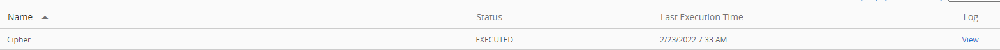
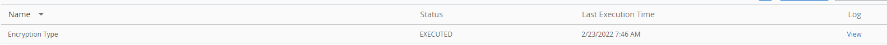

# bitlocker-sensors
Sensor Scripts for Workspace ONE UEM to Configure Bitlocker

These scripts are provided 'as-is' and is not supported by VMware

They should be deployed as Workspace ONE UEM Sensors for Windows 10/11

------

**bitlocker_cipher_strength_sensor.ps1** - Set the Encryption Cipher Strength for Bitlocker Enabled Drives (OS, Physical or Removable)

Return Type: String

Run Context: System

Usage:  

​	Update the following lines:

​				`$key_name = "drive-type"` - Which type of drive to set the cipher value for:

​							Values:

​								OS Drive - EncryptionMethodWithXtsOs  
​								Fixed Drives - EncryptionMethodWithXtsFdv  
​								Removable Drives - EncryptionMethodWithXtsRdv 

​								Example:  `$key_name = "EncryptionMethodWithXtsRdv"` 

​				  `$ciphervalue = "cipher-value"` - The cipher value

​							Values:

​									AES-CBC 128-bit = 3 
​									AES-CBC 256-bit = 4 
​									XTS-AES 128-bit (default) - 6 
​									XTS-AES 256-bit - 7 

​									Example:  `$cipher = "7"`

Output:

------

**bitlocker_encryption_type_sensor.ps1** - Set the Encryption Type for Bitlocker to go Enabled Removable Drives.	

Return Type: String

Run Context: System

Usage:  

​	Update the following line:

​				`$encryptionvalue = "0"` - How to Encrypt Removable Drives

​							Values:

​							 Allow User To Choose (Default) - 0 							 Used Space Only Encryption - 3  
​							 Full Disk Encryption- 4  

​							Example:  `$encryptionvalue  = "4"` Output:

------

